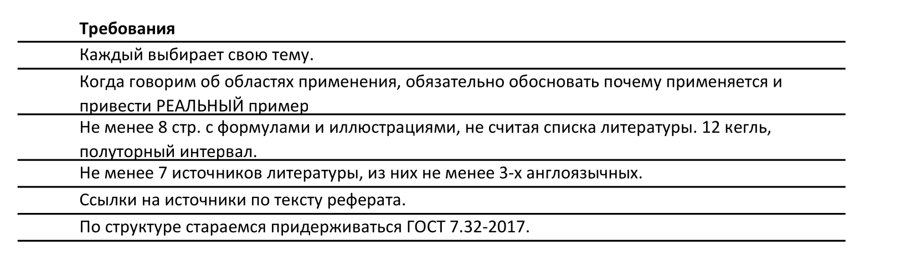

# Векторное управление и широтно-импульсные преобразователи для двигателей переменного тока

## Векторное управление

Векторное управление — это современная методика управления двигателями переменного тока (чаще всего асинхронными или синхронными двигателями с постоянными магнитами), которая позволяет точно контролировать момент и скорость двигателя. Основное преимущество векторного управления заключается в том, что оно разделяет управление моментом и магнитным полем двигателя, что позволяет более точно и эффективно управлять работой электродвигателя. Это особенно полезно в приложениях, где требуется высокая динамика и точность управления.
Основные моменты:

    - Векторное управление преобразует трёхфазные токи в двухфазные координаты векторов (обычно в систему координат d-q).
    - Управление моментом и магнитным потоком происходит отдельно, что позволяет достичь более высокой точности.
    - В сочетании с датчиками обратной связи (например, датчики положения ротора) можно контролировать движение двигателя в реальном времени.

## Широтно-импульсные преобразователи (ШИМ, PWM)

ШИМ-преобразователи используются для регулирования напряжения и частоты, подаваемых на двигатель, что позволяет управлять его скоростью и моментом. ШИМ-преобразователь представляет собой инвертор, который формирует сигнал с изменяющейся шириной импульсов. С помощью ШИМ можно управлять скоростью вращения двигателя, изменяя среднее напряжение на его обмотках.
Основные моменты:

    - ШИМ использует высокочастотное переключение для управления подачей энергии на двигатель.
    - Он позволяет контролировать среднее напряжение и частоту, что важно для изменения скорости двигателя.
    - В современных системах ШИМ-инверторы обеспечивают плавное и точное регулирование.

Применение:

Эти технологии находят применение в электроприводах, системах управления движением, робототехнике, станках с ЧПУ и многих других промышленных приложениях, где требуется точное управление моментом и скоростью.

## Управление бесколлекторными электродвигателями

Источники:

- "Control of Electric Machine Drive Systems" — Seung-Ki Sul. Отличная книга, посвящённая управлению электрическими приводами, включая векторное управление и ШИМ.

- "Field-Oriented Control of Induction Motors" — IEEE Transactions on Industrial Electronics. Важная статья по основам FOC.

Правила:
