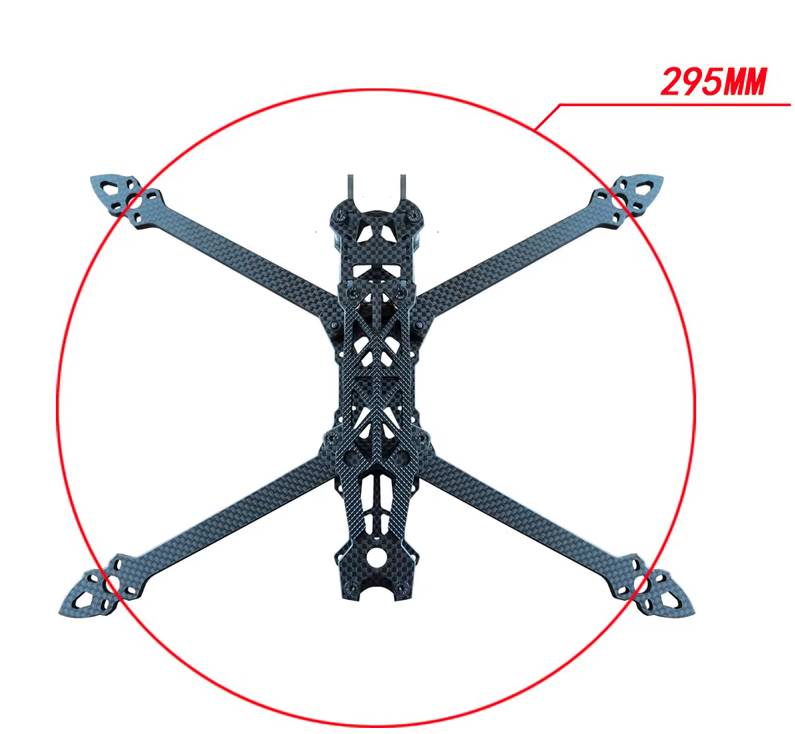
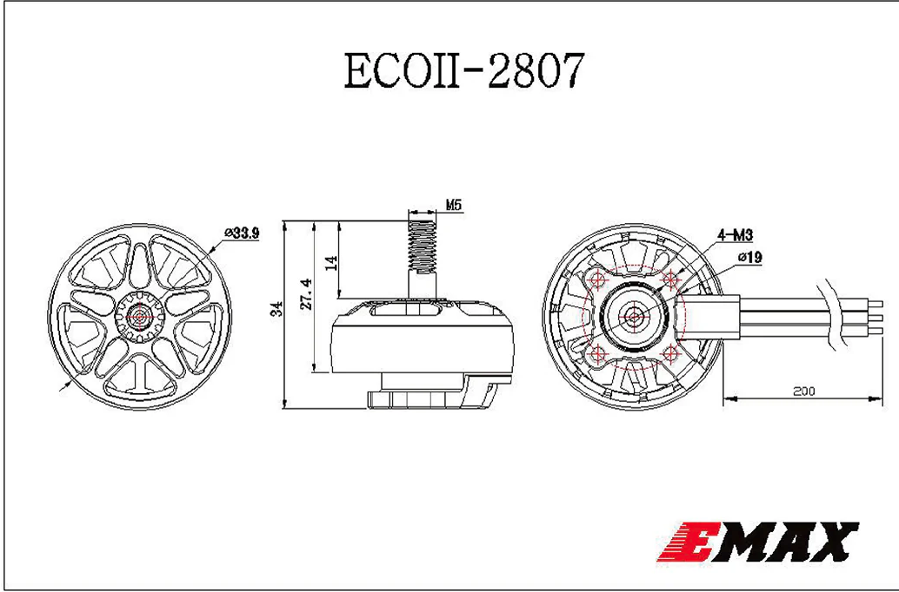
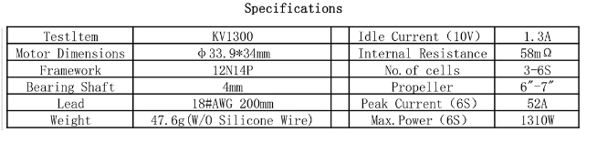
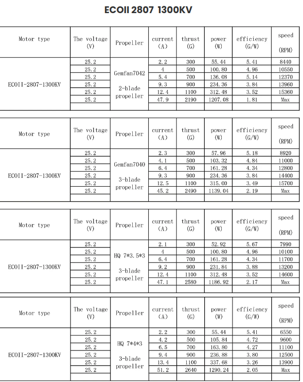
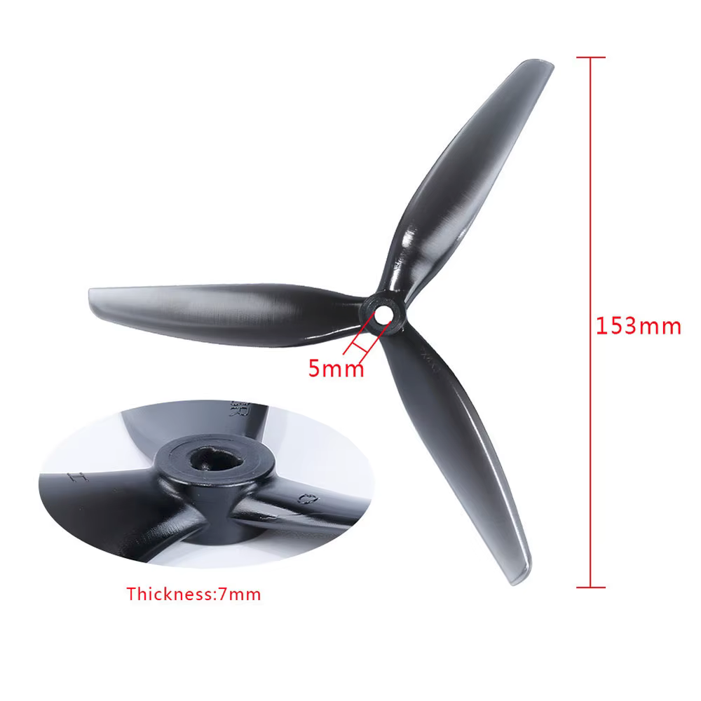

## Список компонентов

- Рама: GEP-MARK4-7. [Подробнее](#рама)
- Электромоторы БДПТ(BLDC): EMAX ECO II 2807-1300KV. [Подробнее](#электромоторы)
- Контроллер бесколлекторного двигателя(ESC): SpeedyBee BLS 55A 30x30 4-in-1 ESC. [Подробнее](#контроллер-бесколлекторного-двигателяesc)
- Контроллер полета: SpeedyBee F405 V4 30x30 Flight. [Подробнее](#контроллер-полета-speedybee-f405-v4-30x30-flight)
- Аккумулятор: 4s1p. [Подробнее]()
- Винты: HQProp 7X4X3. [Подробнее]()

### Рама

| Product name                          | GEP-Mark4-7 |
|---------------------------------------|-------------|
| Frame type                            | H type      |
| Arm thickness                         | 5mm         |
| Wheelbase                             | 295mm       |
| Dimension                             | 226*266mm   |
| Weight                                | 121g        |
| Base plate                            | 3mm         |
| Top plate                             | 3mm         |
| Side plate                            | 2.5mm       |
| Plywood thickness                     | 2mm         |
| Front and rear protective frame plate | 2.5mm       |

### Электромоторы

### Контроллер бесколлекторного двигателя(ESC)

Подробнее в файле SpeedyBee_F405_V4_Stack_Manual_EN.pdf

| Product Name                  | SpeedyBee BLS 55A 30x30 4-in-1 ESC       |
|-------------------------------|------------------------------------------|
| Firmware                      | BLHeli_S J-H-40                          |
| PC Configurator Download Link | https://esc-configurator.com/            |
| Continuous Current            | 55A * 4                                  |
| Burst Current                 | 70(10 seconds)                           |
| TVS Protective diode          | Yes                                      |
| External Capacitor            | 1000uF Low ESR Capacitor(In the package) |
| ESC Protocol                  | DSHOT300/600                             |
| Power Input                   | 3-6S LiPo                                |
| Power Output                  | VBAT                                     |
| Current Sensor                | Support (Scale=400 Offset=0)             |
| ESC Telemetry                 | Not supported                            |
| Mounting                      | 30.5 x 30.5mm( 4mm hole diameter)        |
| Dimension                     | 45.6(L) * 44(W) *8mm(H)                  |
| Weight                        | 23.5g                                    |

### Контроллер полета: SpeedyBee F405 V4 30x30 Flight 

Подробнее в файле SpeedyBee_F405_V4_Stack_Manual_EN.pdf

| Product Name                   | SpeedyBee F405 V4 30x30 Flight Controller                                                                                                                                                                                                                                                                                                                                                                                                                                                                                                                                                        |        |         |
|--------------------------------|--------------------------------------------------------------------------------------------------------------------------------------------------------------------------------------------------------------------------------------------------------------------------------------------------------------------------------------------------------------------------------------------------------------------------------------------------------------------------------------------------------------------------------------------------------------------------------------------------|--------|---------|
| MCU                            | STM32F405                                                                                                                                                                                                                                                                                                                                                                                                                                                                                                                                                                                        |        |         |
| IMU(Gyro)                      | ICM42688P                                                                                                                                                                                                                                                                                                                                                                                                                                                                                                                                                                                        |        |         |
| USB Port Type                  | Type-C                                                                                                                                                                                                                                                                                                                                                                                                                                                                                                                                                                                           |        |         |
| Barometer                      | Built-in                                                                                                                                                                                                                                                                                                                                                                                                                                                                                                                                                                                         |        |         |
| OSD Chip                       | AT7456E chip                                                                                                                                                                                                                                                                                                                                                                                                                                                                                                                                                                                     |        |         |
| BLE Bluetooth                  | Supported. Used for Flight Controller configuration (MSP should be enabled with Baud                                                                                                                                                                                                                                                                                                                                                                                                                                                                                                             |        |         |
| rate 115200 on UART4)          |                                                                                                                                                                                                                                                                                                                                                                                                                                                                                                                                                                                                  |        |         |
| WIFI                           | Not supported                                                                                                                                                                                                                                                                                                                                                                                                                                                                                                                                                                                    |        |         |
| DJI Air Unit Connection Way    | Two ways supported: 6-pin connector or direct soldering.                                                                                                                                                                                                                                                                                                                                                                                                                                                                                                                                         |        |         |
| 6-pin DJI Air Unit Plug        | Supported. Completely compatible with DJI O3/RunCam Link/Caddx Vista/DJI Air Unit V1,no wire is needed to be changed.                                                                                                                                                                                                                                                                                                                                                                                                                                                                            |        |         |
| Current Sensor Input           | Supported. For SpeedyBee BLS 55A ESC, please set scale = 400 and Offset = 0.                                                                                                                                                                                                                                                                                                                                                                                                                                                                                                                     |        |         |
| Power Input                    | 3S - 6S Lipo(Through G, BAT pins/pads from the 8-pin connector or 8-pads on the bottom side)                                                                                                                                                                                                                                                                                                                                                                                                                                                                                                     |        |         |
| 5V Output                      | 9 groups of 5V output, four +5V pads and 1 BZ+ pad( used for Buzzer) on front side, and 4x LED 5V pads. The total current load is 3A.                                                                                                                                                                                                                                                                                                                                                                                                                                                            |        |         |
| 9V Output                      | 2 groups of 9V output, one +9V pad on front side and other included in a connector on bottom side. The total current load is 3A.                                                                                                                                                                                                                                                                                                                                                                                                                                                                 |        |         |
| 3.3V Output                    | Supported. Designed for 3.3V-input receivers. Up to 500mA current load.                                                                                                                                                                                                                                                                                                                                                                                                                                                                                                                          |        |         |
| 4.5V Output                    | Supported. Designed for receiver and GPS module even when the FC is powered through theUSB port. Up to 1A current load.                                                                                                                                                                                                                                                                                                                                                                                                                                                                          |        |         |
| ESC Signal                     | M1 - M4 on bottom side and M5-M8 on front side.                                                                                                                                                                                                                                                                                                                                                                                                                                                                                                                                                  |        |         |
| UART                           | 6 sets(UART1, UART2, UART3, UART4(Dedicated for Bluetooth connection)), UART5(Dedicated for ESC telemetry),UART6                                                                                                                                                                                                                                                                                                                                                                                                                                                                                 |        |         |
| ESC Telemetry                  | UART R5(UART5)                                                                                                                                                                                                                                                                                                                                                                                                                                                                                                                                                                                   |        |         |
| Traditional Betaflight LED Pad | Supported. 5V, G and LED pads on bottom of the front side. Used for WS2812 LED controlled by Betaflight firmware.                                                                                                                                                                                                                                                                                                                                                                                                                                                                                |        |         |
| I2C                            |  "Supported. SDA & SCL pads on front side. Used for magnetometer                                                                                                                                                                                                                                                                                                                                                                                                                                                                                                                                 |  sonar |  etc."  |
| Buzzer                         | BZ+ and BZ- pad used for 5V Buzzer                                                                                                                                                                                                                                                                                                                                                                                                                                                                                                                                                               |        |         |
| BOOT Button                    | Supported.[A]. Press and hold BOOT button and power the FC on at the same time will force the FC to enter DFU mode, this is for firmware flashing when the FC gets bricked. [B]. When the FC is powered on and in standby mode, the BOOT button can be used to controller the LED strips connected to LED1-LED4 connectors on the bottom side. By default, short-press the BOOT button to cycle the LED displaying mode. Long-press the BOOT button to switch between SpeedyBee-LED mode and BF-LED mode. Under BF-LED mode, all the LED1-LED4 strips will be controlled by Betaflight firmware. |        |         |
| RSSI Input                     | Supported. Named as RS on the front side.                                                                                                                                                                                                                                                                                                                                                                                                                                                                                                                                                        |        |         |
| Smart Port / F.Port            | Not supported                                                                                                                                                                                                                                                                                                                                                                                                                                                                                                                                                                                    |        |         |
| Supported Flight Controller    | BetaFlight(Default), INAV                                                                                                                                                                                                                                                                                                                                                                                                                                                                                                                                                                        |        |         |
| Firmware Target Name           | SPEEDYBEEF405V4                                                                                                                                                                                                                                                                                                                                                                                                                                                                                                                                                                                  |        |         |
| Mounting                       | 30.5 x 30.5mm( 4mm hole diameter)                                                                                                                                                                                                                                                                                                                                                                                                                                                                                                                                                                |        |         |
| Dimension                      | 41.6(L) x 39.4(W) x 7.8(H)mm                                                                                                                                                                                                                                                                                                                                                                                                                                                                                                                                                                     |        |         |
| Weight                         | 10.5g                                                                                                                                                                                                                                                                                                                                                                                                                                                                                                                                                                                            |        |         |

### Аккумулятор

| Тип аккумулятора        | Li-ion 6s1p |
|-------------------------|-------------|
| Номинальное напряжение  | 14.8        |
| Номинальная Емкость     | 3800 мАч    |
| Максимальное напряжение | 16.8        |

### Лопасти

HQProp 7X4X3 7040 7 дюймов 3 лопасти

